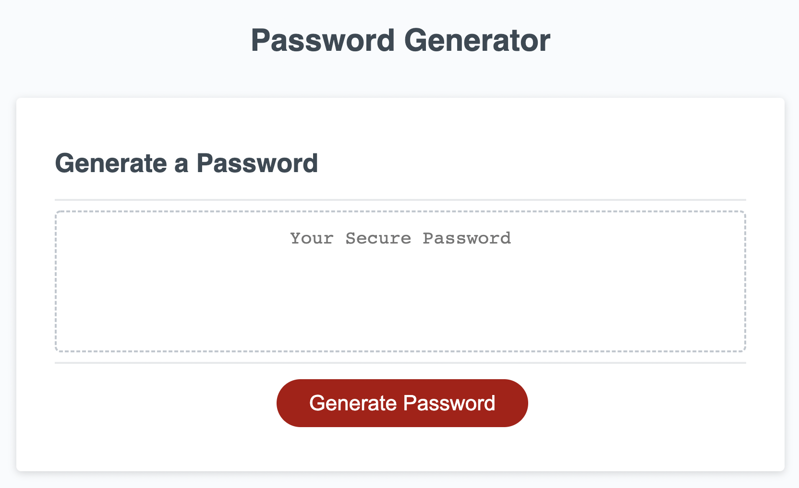

# Password Generator Starter Code

## Purpose
This password generator helps you create strong passwords. To use this password generator, you will be asked a few questions in the beginning. First, you should provide a whole number between 8-128. This number will be your password length. Then, you can choose whether or not you want to include numbers and lower case/upper case/special characters. If you do not select an option, you will need to start from the beginning and enter a number again.

## Screenshot of the project

## Future Improvements
This password generator goes through a few loops in a specific order to create a password string that could easily get hacked. Although the shuffle() function shuffles the elements in the finalPassword array, finding a new way that randomly goes through the loops will generate stronger passwords.

## Built with
* HTML
* CSS
* JavaScript

## Website
https://sanam1060.github.io/friendly-parakeet/

## Contribution
Made with ❤️ by Sanam G - July 2022
